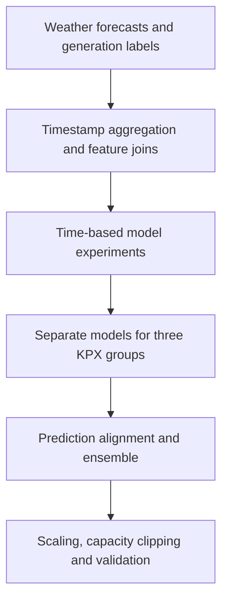

# Wind Power Forecasting

A tabular machine-learning workflow for hourly wind generation forecasts, built for the [DACON BARAM 2026 competition](https://dacon.io/competitions/official/236727/overview/description).

The project turns LDAPS and GFS weather forecasts into timestamp-level features, trains a separate regressor for each KPX group, and compares feature, ensemble and calibration choices with time-based validation.

## Project at a Glance

| Item | Implementation |
|---|---|
| Prediction targets | `kpx_group_1`, `kpx_group_2`, `kpx_group_3` |
| Inputs | LDAPS/GFS weather forecasts and calendar features |
| Model families | RandomForest, LightGBM, CatBoost and XGBoost |
| Main local split | Train on years before 2024; validate on 2024 |
| Recorded ensemble | Equal-weight tuned and targeted-weather LightGBM |
| Output constraints | Non-negative predictions, clipped to group capacity |
| Experiment artifacts | Models, predictions and JSON summaries stored locally |

The documentation focuses on methods, reproducibility and engineering decisions. Original development records are retained in the repository.

## Modeling Workflow



1. Aggregate weather-grid values by `forecast_kst_dtm` and join them to label or sample-submission timestamps.
2. Combine calendar signals with mean weather forecasts; compare wind-vector and targeted-weather feature variants.
3. Fit median imputation on the training split and train one model per target using its available labels.
4. Evaluate forecast error and settlement-oriented behavior together.
5. Align ensemble members to the official sample, combine predictions, and apply the selected postprocessing.
6. Validate the generated submission structure and prediction bounds.

See [model design](docs/MODEL_DESIGN.md) for module responsibilities, feature formulas and evaluation behavior.

## What the Experiments Explore

| Question | Experiment direction |
|---|---|
| Which model family provides a useful baseline? | RandomForest, LightGBM, CatBoost and XGBoost comparisons |
| Do additional wind variables help? | Wind speed/direction derivatives and targeted height-specific features |
| Does feature diversity help an ensemble? | Tuned and targeted-weather models, weight search, selective XGBoost inclusion |
| Does calibration transfer to another period? | Global scaling, group-wise scaling and rolling-year evaluation |
| Does training diversity improve stability? | Multiple seeds and regression-objective variants |

The important lessons are that added features need a controlled comparison, ensemble diversity should be measured on aligned predictions, and calibration selected on one year needs validation on other periods. A rolling experiment can only support a multi-year conclusion when multiple folds are actually evaluable.

The [experiment guide](docs/EXPERIMENT_GUIDE.md) maps these questions to scripts and explains how to extend them.

## Quick Start

Run commands from the repository root. Python, NumPy, pandas, scikit-learn, LightGBM and joblib support the main LightGBM route; CatBoost and XGBoost support their respective comparison scripts.

`requirements.txt` retains the original pinned environment, including development dependencies, in UTF-16 encoding:

```powershell
python -m venv .venv
.\.venv\Scripts\Activate.ps1
python -m pip install -r requirements.txt
```

For a data-free check of the metric implementation:

```powershell
python src/dacon_wind/metric.py
```

Training requires authorized local competition inputs. There is no automatic dataset download. The [reproduction guide](docs/REPRODUCIBILITY.md) lists the inputs, complete command order, generated artifacts and troubleshooting steps.

### Local Validation

```powershell
python scripts/train_lgbm_cv.py
```

This trains a baseline on earlier years and evaluates on 2024. It writes validation predictions, a model bundle and a JSON run summary.

### Recorded Ensemble and Submission Route

```powershell
python scripts/train_lgbm_tuned_submit.py
python scripts/train_lgbm_targeted_weather_submit.py
python scripts/create_ensemble_submission.py
python scripts/create_ficr_postprocess_submission.py
python scripts/create_scale_110_submission.py
python scripts/validate_submission.py submissions/lgbm_008_scale_110.csv
```

The intermediate scale-1.03 file is needed by the scale-1.10 script for comparison and row alignment. The final predictions are computed from the original ensemble with a direct 1.10 multiplier.

Submission scripts use fixed artifact names and refuse to overwrite existing outputs. Preserve previous runs and use a fresh working copy when reproducing the full route.

## Repository Guide

| Path | Role |
|---|---|
| [`src/dacon_wind/data.py`](src/dacon_wind/data.py) | Read local labels, weather and sample data; parse timestamps |
| [`features.py`](src/dacon_wind/features.py) | Calendar, grid aggregation and weather-derived features |
| [`cv.py`](src/dacon_wind/cv.py) | Main time-based train/validation masks |
| [`metric.py`](src/dacon_wind/metric.py) | Group capacities, eligible rows and combined evaluation formula |
| [`models.py`](src/dacon_wind/models.py) | Shared RandomForest/LightGBM training helpers |
| [`scripts/`](scripts/) | Model experiments, submission generation and validation |
| [`notebooks/`](notebooks/) | Baseline and metric reference notebooks |
| [Model design](docs/MODEL_DESIGN.md) | Data flow, feature variants and model/evaluation contracts |
| [Reproduction guide](docs/REPRODUCIBILITY.md) | Environment, inputs, commands, outputs and common failures |
| [Experiment guide](docs/EXPERIMENT_GUIDE.md) | Experiment map and extension procedure |
| [Sources](docs/SOURCES.md) | Official competition, data, rules and metric references |

[Experiment log](docs/experiment_log.md), [experiment feedback](docs/experiment_feedback.md), [workflow notes](docs/workflow.md), `start-plan.md`, `AGENTS.md` and `prompts/` preserve the original development context. Dated status notes describe the project at that point in its history.

## Local Data and Artifacts

Keep competition inputs under `data/raw/`, model bundles under `outputs/models/`, predictions under `outputs/predictions/`, JSON summaries under `outputs/logs/`, and final CSVs under `submissions/`.

These files are excluded from Git. Input filenames and artifact paths are documented so the code can be followed without redistributing the dataset or generated predictions.

## Technical Considerations

- The main holdout is one calendar year. Repeated feature, ensemble and scale selection on that holdout can overfit.
- Weather aggregation excludes `data_available_kst_dtm` and does not apply an availability-time filter. A cutoff-aware data selection layer is a useful next extension.
- Group-specific scaling adds calibration flexibility and can overfit more easily than a single shared scale.
- The CSV validator checks shape, column order, missing/nonnumeric values and capacity bounds. Ensemble/postprocessing scripts separately check forecast ID and timestamp alignment.
- Submission training scripts refit models on all available training labels. They do not rerun parameter search or the full validation experiment sequence.
- Full training and inference depend on the local competition data and original environment. This documentation update does not include a new full-data training run.
